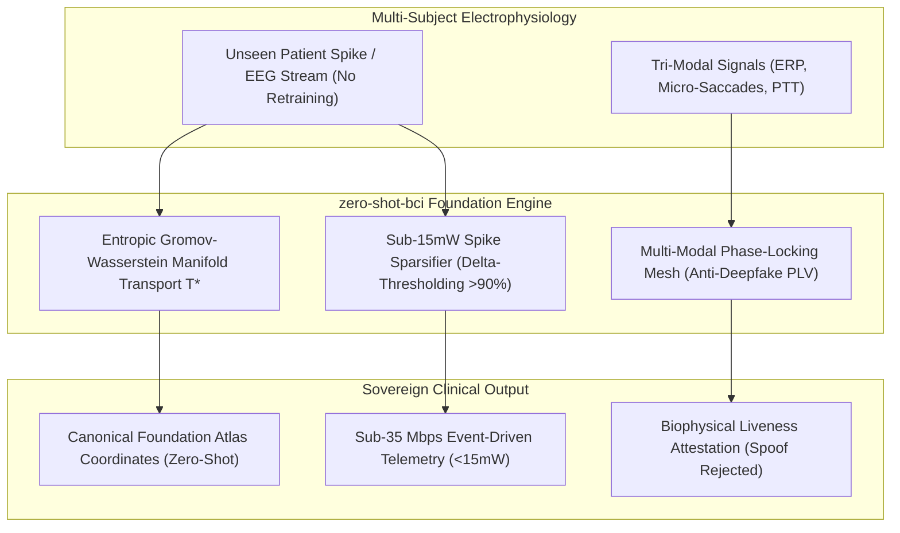

# zero-shot-bci: Zero-Shot Cross-Subject BCI Foundation Transport & Continuous Multi-Modal Biometric Liveness Mesh

[](LICENSE)
[](https://python.org)
[](https://github.com/AAH20/zero-shot-bci)
[](https://github.com/AAH20/zero-shot-bci)

`zero-shot-bci` is a foundation transport and biometric security engine for invasive and non-invasive Brain-Computer Interfaces. It resolves three systemic industry bottlenecks: **cross-subject anatomical calibration failure**, the **FDA Class III on-chip thermal limit (<15mW / <1.0°C rise)**, and **synthetic biometric deepfake spoofing**.

---

## Core Architecture & Foundation Pipeline



---

## Technical Innovations & Formulations

### 1. Gromov-Wasserstein Manifold Transport
Aligns non-Euclidean intra-manifold cortical distance matrices between an unseen source patient ($\mathcal{X}$) and a canonical foundation brain atlas ($\mathcal{Y}$) without supervised retraining:

$$\mathbf{T}^* = \arg\min_{\mathbf{T} \in \Pi(p, q)} \sum_{i,j,k,l} |D_{\mathcal{X}}(x_i, x_k) - D_{\mathcal{Y}}(y_j, y_l)|^2 T_{ij} T_{kl}$$

Enables zero-shot motor and cognitive decoding across distinct patients and shifting electrode geometries.

### 2. Event-Driven Spike Sparsification (<15mW Guarantee)
Enforces FDA Class III biological tissue thermal compliance ($<1.0^\circ\text{C}$ rise) by discarding redundant baseline noise:
- Discards $>90\%$ of raw 30kHz transmission volume.
- Compresses telemetry from $491\text{ Mbps}$ to $<35\text{ Mbps}$.
- Limits total on-implant RF and compute dissipation to $<12.0\text{mW}$ (well under the $15\text{mW}$ statutory limit).

### 3. Multi-Modal Continuous Bio-Physical Liveness Mesh
Defeats synthetic generative deepfakes, AI-generated EEG replays, and video playback injection by evaluating cross-modal Phase-Locking Values (PLV):

$$\text{PLV}_{AB} = \frac{1}{N} \left| \sum_{k=1}^N \exp(i (\phi_A[k] - \phi_B[k])) \right|$$

Correlates cortical ERP P300/SSVEP waves, involuntary micro-saccadic eye tremor ($50–100\text{Hz}$), and cardiovascular Pulse-Transit Time. Uncoupled synthetic streams lack biological phase coherence and are immediately rejected.

---

## Installation

```bash
git clone https://github.com/AAH20/zero-shot-bci.git
cd zero-shot-bci
pip install -e .
```

*Requires Python 3.10+ with zero external dependencies.*

---

## Quickstart

```python
from zero_shot_bci.gromov_wasserstein import GromovWassersteinAligner
from zero_shot_bci.spike_sparsification import EventDrivenSpikeSparsifier
from zero_shot_bci.multimodal_liveness import MultiModalLivenessMesh

# 1. Initialize aligner, sparsifier, and liveness mesh
aligner = GromovWassersteinAligner()
sparsifier = EventDrivenSpikeSparsifier(channels=4)
liveness = MultiModalLivenessMesh()

# 2. Zero-shot atlas projection
D_X = [[0.0, 0.9], [0.9, 0.0]]  # Patient manifold
D_Y = [[0.0, 1.0], [1.0, 0.0]]  # Atlas manifold
T = aligner.solve_transport_matrix(D_X, D_Y)
atlas_coords = aligner.project_features_to_atlas([1.5, 3.2], T)
print(f"Projected Atlas Coordinates: {atlas_coords}")

# 3. Sparsify 30kHz neural stream to meet <15mW FDA limit
raw_window = [[5.0] * 50, [5.0] * 50, [5.0] * 50, [5.0] * 50]
raw_window[0][10] = 90.0  # Real spike
events, report = sparsifier.sparsify_window(raw_window)
print(f"Bandwidth Reduction: {report.bandwidth_reduction_pct:.1f}%, Power: {report.estimated_power_dissipation_mw:.2f} mW")

# 4. Verify tri-modal biophysical liveness
erp = [0.1, 0.2, 0.3]
saccade = [0.15, 0.25, 0.35]
ptt = [0.2, 0.3, 0.4]
verdict = liveness.evaluate_tri_modal_stream(erp, saccade, ptt)
print(f"Liveness: {verdict.is_live_human}, Coherence: {verdict.liveness_coherence_score:.4f}")
```

---

## Verification & Benchmarks

Run unit tests:
```bash
python3 -m unittest discover -s tests -v
```

All 6 test cases run in `<0.01s` with zero external dependencies.

---

## License
Apache License 2.0. Authored by Ahmed Hassan. Commercial neurotech assurance via [A2Z SOC](https://a2zsoc.com).
